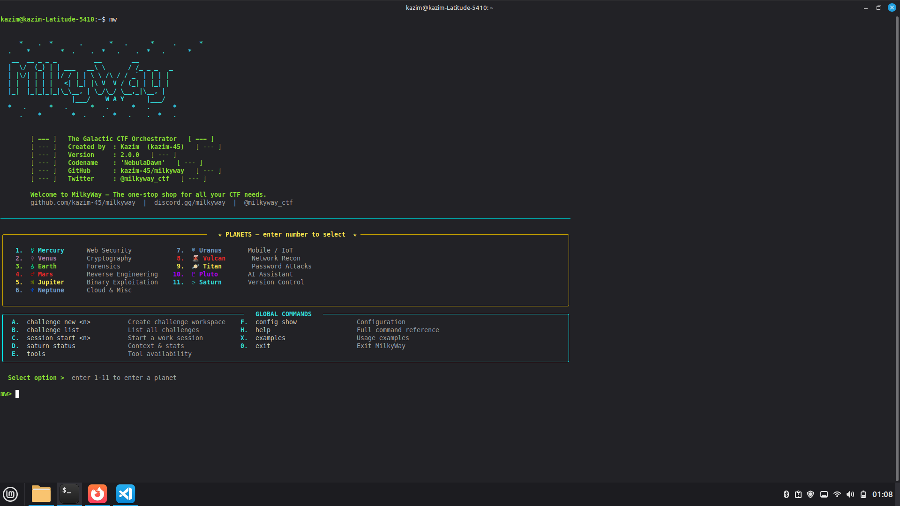
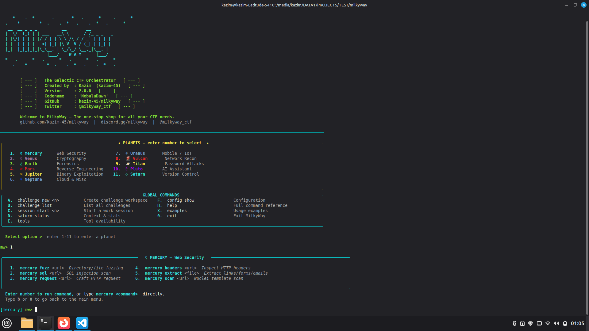
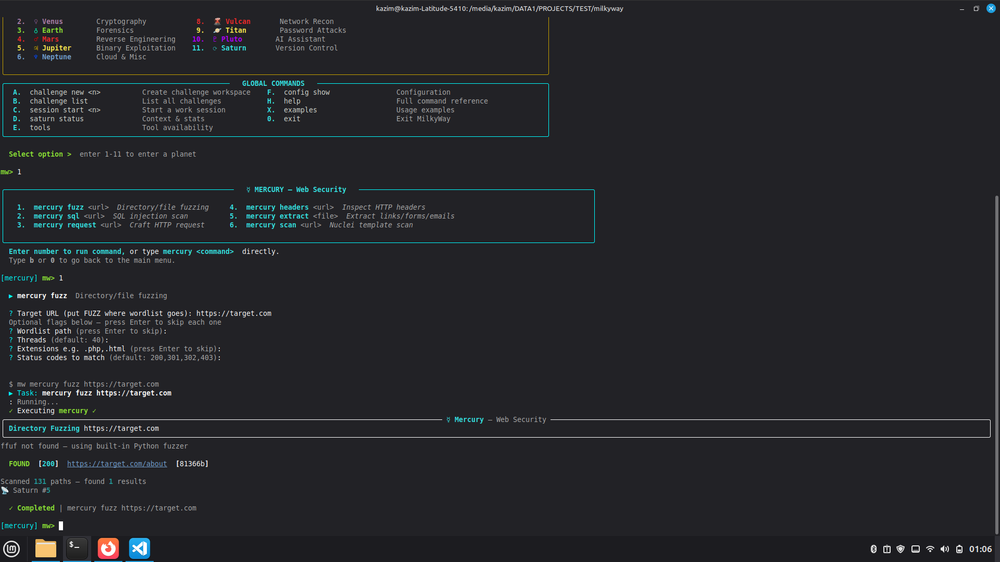

# 🌌 MilkyWay

### *The Galactic CTF Orchestrator*

[](https://python.org)
[](LICENSE)
[](https://github.com/kazim-45/milkyway)
[](CONTRIBUTING.md)

---

## 🚀 What is MilkyWay?

**MilkyWay** is a modular, version-controlled CTF toolkit designed to help security researchers, CTF players, and penetration testers stay organized, reproducible, and efficient.

It brings together:
- A planetary command-line interface for web, crypto, forensics, reverse engineering, binary exploitation, cloud, and AI assistance
- Automatic history, replay, and diffing for every command
- Challenge workspace management with replayable context
- An integrated TUI for fast exploration and discovery

---

## 📸 Screenshots

Below are the current MilkyWay interface snapshots from the `assets/` directory.







---

## ⚡ Quick Start

```bash
# Install
pip install milkyway-ctf

# Create your first challenge workspace
milkyway challenge new pico_web1 --category web --url https://challenge.zip

# Start hacking
cd ~/milkyway-challenges/pico_web1
milkyway mercury fuzz http://target.com/FUZZ
milkyway mercury sql 'http://target.com/page?id=1'

# Ask Pluto for recommendations
milkyway pluto suggest "I found a weird base64 string in the HTTP response"

# Review the session history
milkyway saturn log

# Replay a successful run
milkyway saturn redo 42

# Launch the interactive TUI
milkyway tui
```

---

## 🪐 Planetary Tool Map

| Planet | Domain | Key Commands |
|--------|--------|--------------|
| **☿ Mercury** | Web Security | `mercury fuzz`, `mercury sql`, `mercury request`, `mercury headers`, `mercury extract`, `mercury scan` |
| **♀ Venus** | Cryptography | `venus identify`, `venus hash`, `venus crack`, `venus encode`, `venus decode`, `venus xor`, `venus factor` |
| **♁ Earth** | Forensics | `earth info`, `earth carve`, `earth strings`, `earth hexdump`, `earth steg`, `earth pcap` |
| **♂ Mars** | Reverse Engineering | `mars disassemble`, `mars info`, `mars symbols`, `mars trace`, `mars r2` |
| **♃ Jupiter** | Binary Exploitation | `jupiter checksec`, `jupiter rop`, `jupiter template`, `jupiter cyclic` |
| **♆ Neptune** | Cloud & Misc | `neptune jwt`, `neptune cloud`, `neptune url` |
| **♇ Pluto** | AI Assistant | `pluto suggest`, `pluto analyze`, `pluto cheatsheet` |
| **🪐 Saturn** | Version Control | `saturn log`, `saturn diff`, `saturn redo`, `saturn status`, `saturn annotate`, `saturn export` |

---

## 🎯 Feature Highlights

### Saturn — Command History with Replay

Every command run through MilkyWay is tracked and replayable.

```bash
$ milkyway saturn log
┌────┬─────────────────────┬─────────┬────────┬───────────────────────────────────┬──────┐
│ ID │ Timestamp           │ Planet  │ Action │ Command                           │ Exit │
├────┼─────────────────────┼─────────┼────────┼───────────────────────────────────┼──────┤
│ 42 │ 2025-04-01 14:23:15 │ mercury │ fuzz   │ milkyway mercury fuzz http://...  │ 0    │
│ 41 │ 2025-04-01 14:20:03 │ venus   │ decode │ milkyway venus decode aGVsbG8=    │ 0    │
│ 40 │ 2025-04-01 14:15:22 │ earth   │ carve  │ milkyway earth carve firmware.bin │ 0    │
└────┴─────────────────────┴─────────┴────────┴───────────────────────────────────┴──────┘

$ milkyway saturn redo 40
[Replaying run #40] earth carve firmware.bin

$ milkyway saturn diff 41 42
# Compare output from different commands
```

### Challenge Workspaces — Organized Context

MilkyWay creates dedicated challenge folders with metadata, notes, artifacts, and outputs.

```bash
$ milkyway challenge new hackthebox_web --category web --url https://app.hackthebox.com/...
✓ Challenge created!

Name:     hackthebox_web
Category: web
Path:     ~/milkyway-challenges/hackthebox_web

# Auto-generated structure:
~/milkyway-challenges/hackthebox_web/
├── .milkyway/          # Local Saturn DB + config
├── files/              # Downloaded challenge artifacts
├── solutions/
│   └── solve.py        # Starter exploit script
├── outputs/            # Tool outputs
├── notes.md            # Observations and findings
└── README.md           # Auto-generated challenge summary
```

### Pluto — AI Guidance

Pluto offers actionable suggestions based on your challenge context.

```bash
$ milkyway pluto suggest "I found a suspicious file with no extension, it might be an image"

## ♇ Pluto Suggestion

### Earth — detected keyword: file, image

Try these commands:
```bash
milkyway earth info ./suspicious_file     # Full file analysis
milkyway earth strings ./suspicious_file  # Extract readable strings
milkyway earth hexdump ./suspicious_file  # Inspect raw bytes
milkyway earth carve ./suspicious_file    # Extract embedded files
```

If it's an image, also check for steganography:
```bash
milkyway earth steg ./suspicious_file
```
```

---

## 📦 Installation

```bash
# PyPI (recommended)
pip install milkyway-ctf

# Docker (zero dependencies — everything pre-installed)
docker run -it --rm -v $(pwd):/workspace ghcr.io/kazim-45/milkyway

# From source
git clone https://github.com/kazim-45/milkyway
cd milkyway
pip install -e .
```

See [docs/INSTALL.md](docs/INSTALL.md) for full installation and configuration details.

---

## 🏗️ Architecture

```
milkyway/
├── milkyway/
│   ├── cli/
│   │   ├── main.py              # Root Click CLI + command registration
│   │   └── planets/
│   │       ├── base.py          # Abstract planet base class
│   │       ├── mercury.py       # Web security tools
│   │       ├── venus.py         # Crypto utilities
│   │       ├── earth.py         # Forensics and file analysis
│   │       ├── mars.py          # Reverse engineering helpers
│   │       ├── jupiter.py       # Binary exploitation helpers
│   │       └── pluto.py         # AI assistant integration
│   ├── core/
│   │   ├── db.py                # Saturn SQLite history engine
│   │   ├── runner.py            # Safe subprocess execution
│   │   ├── challenge_manager.py # Challenge workspace lifecycle
│   │   └── config.py            # User configuration loader
│   ├── tui/
│   │   └── app.py               # Textual UI dashboard
│   └── data/
│       └── wordlists/common.txt # Bundled dictionary resources
├── tests/                       # pytest suite
├── docs/                        # Developer and user documentation
├── scripts/                     # install, publish, release helpers
└── Dockerfile                   # Full containerized environment
```

**Tech stack**: Python 3.9+ · Click · Rich · Textual · SQLite · Ollama/OpenAI

---

## 📖 Documentation

| Resource | Description |
|----------|-------------|
| [docs/INSTALL.md](docs/INSTALL.md) | Platform installation and setup |
| [docs/SATURN.md](docs/SATURN.md) | Version control and history features |
| `milkyway <planet> --help` | Built-in command help |
| `milkyway tools` | Check installed tool wrappers |
| `milkyway pluto cheatsheet web` | Quick reference guide |

---

## 🤝 Contributing

Contributions are welcome for:
- New planet tool wrappers
- Expanded challenge support
- Stability fixes and edge-case handling
- Documentation, examples, and tutorials

Please review [CONTRIBUTING.md](CONTRIBUTING.md) before submitting changes.

---

## 📄 License

MIT License — see [LICENSE](LICENSE).

---

## 🌌 Author

**Kazim** — [github.com/kazim-45](https://github.com/kazim-45)

```bash
$ milkyway --version
MilkyWay 3.1.0 | The Galactic CTF Orchestrator
"Not all who wander are lost — some are just fuzzing."
```
